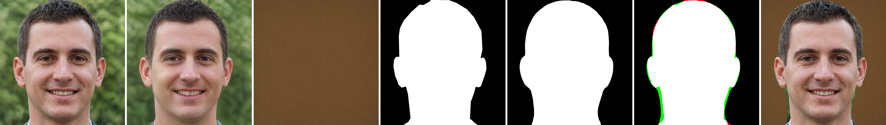
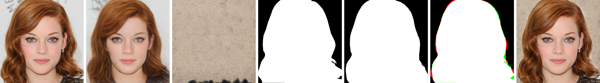

# Реализация метода L4F с поддержкой pSp энкодера
Выполнено в рамках курсового проекта "Приложение генеративных моделей для решения дискриминативных задач", основной задачей которого являлось исследование применения StyleGAN2 для решения задачи сегментации портретных изображений без учителя. 

### Детали реализации
Данный репозиторий получен путем объединения 2 открытых репозиториев: https://github.com/RameenAbdal/Labels4Free.git, https://github.com/eladrich/pixel2style2pixel.git, и внесения собственных изменений. 

### Использование
- Склонировать данный репозиторий:
``` 
git clone https://github.com/uivvyd/L4F_with_pSp.git
cd L4F_with_pSp
```
- Запустить основной скрипт:
```
python scripts/inference.py \
--exp_dir=[Directory for saving results] \
--checkpoint_path=[Path for a pSp FFHQ checkpoint ] \
--data_path=[Directory for testing data] \
--test_batch_size=2 \
--test_workers=4 \
--ckpt_bg_extractor=[Path for an alpha model FFHQ checkpoint] \
--mask_size=[Size of a generated mask]
```

### Примеры работы
<p align="center">


<br>
Выполненная StyleGAN инверсия (2 столбец) с помощью pSp энкодера и последующая сегментация с помощью метода Labels4Free, датасеты: FFHQ, CelebAMask-HQ
</p>
